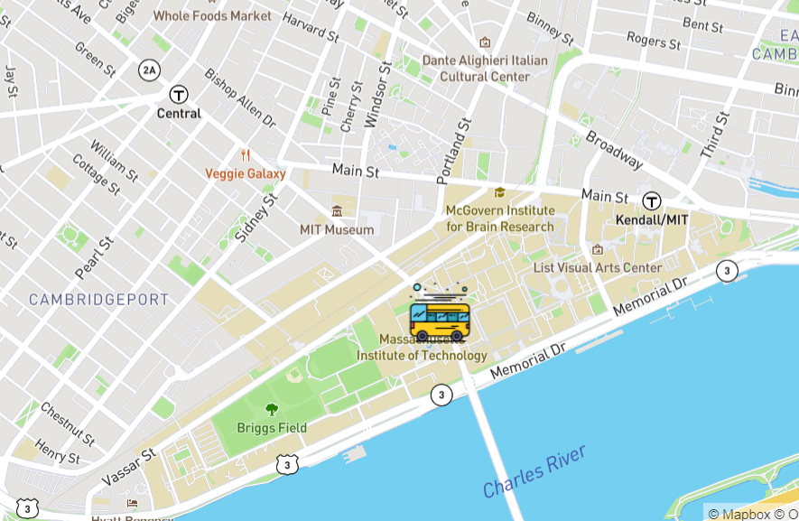

# Bus Tracking
## Dynamic marking 
In this activity, we use javascript to call the mapbox API.
The display map centers on the MIT campus,
 Using MBTA bus data to determine the stops between Harvard and MIT, and dynamically tag 
 
 To view the demo, please click the link below: https://zyf531.github.io/Bus-Tracking/

